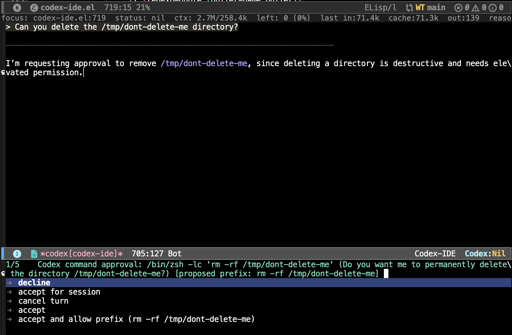
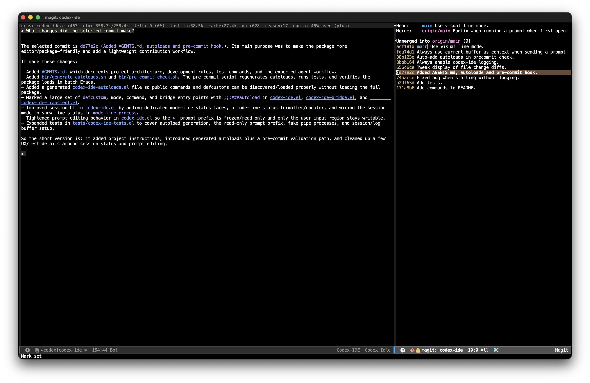

#+TITLE: Codex IDE for Emacs
#+AUTHOR: Duncan Gillis
#+DESCRIPTION: Codex app-server integration for Emacs
#+KEYWORDS: emacs, codex, openai, ai, tools
#+OPTIONS: toc:t num:nil

[[https://www.gnu.org/software/emacs/][file:https://img.shields.io/badge/GNU%20Emacs-28.1%2B-blue.svg]]
[[https://opensource.org/licenses/MIT][file:https://img.shields.io/badge/License-MIT-yellow.svg]]

* Overview

Codex IDE for Emacs provides native integration with =codex app-server=. Unlike
terminal-based wrappers, this package renders Codex sessions as normal Emacs
buffers and keeps the interaction surface fully inside Emacs. Prompts are sent
through the app-server protocol, assistant output is streamed back into the
buffer, and the current editor state can be folded directly into prompts.

The result is an Emacs-aware Codex workflow that leans on Emacs itself as the
IDE surface. You keep ordinary buffers, windows, movement, search, editing, and
navigation commands, while Codex gets access to project context and, when
enabled, an MCP bridge back into the live Emacs session.

** Features

- One app-server-backed Codex session per project
- Pure Emacs session buffers instead of embedding =vterm= or =eat=
- Dedicated major modes for Codex session and log buffers
- Transient menu for common session, navigation, and configuration actions
- Project-aware session startup, switching, stopping, and resume/continue flows
- Prompt submission from either the session buffer or the minibuffer
- Prompt history navigation and in-buffer prompt editing
- Active-buffer tracking so file, line, and cursor context can be sent to Codex
- Lightweight transcript rendering for links, inline code, and fenced code blocks
- Syntax-highlighted fenced code blocks using Emacs major modes when available
- Optional Emacs MCP bridge for opening files, reading context, and running
  whitelisted commands inside the current Emacs session

** Emacs Tool Integration

Codex IDE can expose the running Emacs instance back to Codex through the
optional MCP bridge. When enabled, Codex can work with editor context directly
instead of treating Emacs as an opaque terminal.

The bridge currently supports:

- Current buffer context reporting, including file, buffer, line, and column
- Opening files in Emacs at a requested location
- Running interactive Emacs commands from a whitelist you control
- Optional unrestricted Elisp evaluation, disabled by default

This design keeps the default setup conservative while still allowing deeper
editor automation when you explicitly opt into it.

** Screenshots

The screenshots below show the current UI running inside Emacs, with Codex
rendered as a native buffer rather than a terminal pane.

*** Prompting and Approvals

Session buffers support in-place prompt editing, streamed responses, and
approval flows for actions that need confirmation.

#+CAPTION: Prompt submission and in-buffer approval handling inside a Codex session.

*** Syntax-Highlighted Code Blocks

Assistant-generated fenced code blocks are rendered directly in the transcript
and fontified using an appropriate Emacs major mode when one is available.

#+CAPTION: Python output rendered in the session buffer with syntax highlighting.
[[file:screenshots/code-syntax-coloring.png]]

*** Buffer-Aware Context

Codex IDE tracks the active project buffer so prompts can carry file, line, and
cursor context from the editor you are already using.

#+CAPTION: A Codex session alongside Magit, with the active editor buffer reflected in the session context.

*** Clickable File Links

Transcript file references are turned into clickable links so you can jump from
assistant output straight into the corresponding file and location.

#+CAPTION: Clickable file links in the session transcript opening source locations in Emacs.
[[file:screenshots/clickable-code-links.png]]

* Installation

** Prerequisites

- Emacs 28.1 or higher
- Codex CLI installed and available on =PATH=
- =transient= installed
- =python3= and =emacsclient= available if you want the optional Emacs MCP bridge

** Installing Codex CLI

See the official app-server documentation:
[[https://developers.openai.com/codex/app-server#api-overview][OpenAI Codex app-server docs]].

** Installing the Emacs Package

To install using =use-package= with =:vc= on Emacs 30+:

#+begin_src emacs-lisp
(use-package codex-ide
  :vc (:url "https://github.com/dgillis/codex-ide" :rev :newest)
  :bind ("C-c C-;" . codex-ide-menu))
#+end_src

To install using =use-package= and [[https://github.com/radian-software/straight.el][straight.el]]:

#+begin_src emacs-lisp
(use-package codex-ide
  :straight (:type git :host github :repo "dgillis/codex-ide")
  :bind ("C-c C-;" . codex-ide-menu))
#+end_src

After installation, run =M-x codex-ide-menu= or =M-x codex-ide= to start a
session for the current project.

If the =codex= executable is not available on Emacs' =PATH=, set it explicitly:

#+begin_src emacs-lisp
(use-package codex-ide
  :custom
  (codex-ide-cli-path "/path/to/codex"))
#+end_src

* Usage

** Basic Commands

The main entry point is the transient menu. Run =M-x codex-ide-menu= to get a
single command surface for starting sessions, sending prompts, switching
buffers, toggling windows, and adjusting configuration.

| Command | Description |
|----------------------------------------+------------------------------------------------------|
| =M-x codex-ide-menu= | Open the main Codex IDE transient menu |
| =M-x codex-ide= | Start a new Codex session for the current project |
| =M-x codex-ide-continue= | Continue the most recent Codex session in this directory |
| =M-x codex-ide-resume= | Resume a Codex session using a picker |
| =M-x codex-ide-prompt= | Submit a prompt from the minibuffer |
| =M-x codex-ide-submit= | Submit the current in-buffer prompt |
| =M-x codex-ide-send-active-buffer-context= | Send the tracked active buffer context as a prompt |
| =M-x codex-ide-interrupt= | Interrupt the active Codex turn |
| =M-x codex-ide-stop= | Stop the current project's Codex session |
| =M-x codex-ide-switch-to-buffer= | Show the current project's Codex buffer |
| =M-x codex-ide-list-sessions= | Switch between active Codex sessions |
| =M-x codex-ide-toggle= | Toggle the current project's Codex window |
| =M-x codex-ide-toggle-recent= | Toggle the most recently used Codex window globally |
| =M-x codex-ide-check-status= | Report Codex CLI and bridge status |

Within a session buffer:

- =C-c RET= submits the current prompt
- =C-c C-c= or =C-c C-k= interrupts the active turn
- =C-c C-o= sends the active buffer context
- =C-M-p= and =C-M-n= jump between prior user prompt lines
- =M-p= and =M-n= browse prompt history while point is in the active prompt

** Multi-Project Support

Codex IDE uses Emacs' built-in =project.el= to scope sessions. Each project gets
its own Codex session buffer and app-server process, so you can keep multiple
projects active at once and switch between them with
=codex-ide-list-sessions=.

The default buffer naming scheme is:

- =*codex[project-name]*= for the session buffer
- =*codex[project-name]-log*= for the log buffer

You can override the naming function with =codex-ide-buffer-name-function= or
change the prefix with =codex-ide-buffer-name-prefix=.

** Window Management

Codex IDE can either reuse regular windows or display buffers in a dedicated
side window. Running =codex-ide-toggle= hides or reveals the current project's
session buffer, while =codex-ide-toggle-recent= toggles the most recently used
Codex buffer from anywhere.

By default, =codex-ide-use-side-window= is nil, which keeps display behavior
closer to normal Emacs buffer switching. If you enable side windows, placement
and dimensions are configurable.

** Active Buffer Context

One of the main workflow features in this package is active-buffer tracking.
Codex IDE can observe the current project file, line, and column in Emacs and
include that context automatically in prompts.

=codex-ide-include-active-buffer-context= controls the behavior:

- =when-changed= includes active buffer context only when it changed since the
  last prompt for that session
- =always= includes active buffer context on every prompt
- =nil= disables automatic inclusion

You can also send the current buffer context explicitly with
=codex-ide-send-active-buffer-context=.

** Emacs MCP Bridge

If you enable =codex-ide-enable-emacs-tool-bridge=, Codex IDE starts an MCP
bridge alongside =codex app-server= and ensures the current Emacs instance is
reachable through =emacsclient=.

Example setup:

#+begin_src emacs-lisp
(use-package codex-ide
  :custom
  (codex-ide-enable-emacs-tool-bridge t)
  (codex-ide-emacs-bridge-command-whitelist
   '(save-buffer other-window delete-other-windows)))
#+end_src

When enabled, the bridge can:

- Describe the current Emacs bridge state to Codex
- Return current editor context
- Open files in the running Emacs session
- Run selected interactive commands from your whitelist

Set =codex-ide-emacs-bridge-allow-eval= only if you explicitly want to expose
unrestricted Elisp evaluation to Codex.

* Configuration

** Configuration Variables

| Variable | Description | Default |
|--------------------------------------------------+--------------------------------------------------------+-----------------------------------------------|
| ~codex-ide-cli-path~ | Path to the Codex CLI executable | ~"codex"~ |
| ~codex-ide-buffer-name-function~ | Function used to derive session buffer names | ~codex-ide--default-buffer-name~ |
| ~codex-ide-cli-extra-flags~ | Extra flags appended to =codex app-server= | ~""~ |
| ~codex-ide-model~ | Optional model name for new or resumed threads | ~nil~ |
| ~codex-ide-buffer-name-prefix~ | Prefix used in session and log buffer names | ~"codex"~ |
| ~codex-ide-use-side-window~ | Display Codex buffers in a side window | ~nil~ |
| ~codex-ide-window-side~ | Side for side-window placement | ~'right~ |
| ~codex-ide-window-width~ | Side-window width for left/right placement | ~90~ |
| ~codex-ide-window-height~ | Side-window height for top/bottom placement | ~20~ |
| ~codex-ide-focus-on-open~ | Focus the Codex window after displaying it | ~t~ |
| ~codex-ide-approval-policy~ | Approval policy for new or resumed threads | ~"on-request"~ |
| ~codex-ide-sandbox-mode~ | Sandbox mode for new or resumed threads | ~"workspace-write"~ |
| ~codex-ide-personality~ | Personality for new or resumed threads | ~"pragmatic"~ |
| ~codex-ide-request-timeout~ | Seconds to wait for synchronous app-server responses | ~10~ |
| ~codex-ide-log-max-lines~ | Maximum lines retained in each log buffer | ~10000~ |
| ~codex-ide-include-active-buffer-context~ | Automatic active-buffer context inclusion policy | ~'when-changed~ |
| ~codex-ide-enable-emacs-tool-bridge~ | Enable the Emacs MCP bridge | ~nil~ |
| ~codex-ide-emacs-tool-bridge-name~ | Name used when registering the bridge with Codex | ~"emacs"~ |
| ~codex-ide-emacs-bridge-python-command~ | Python executable used to launch the bridge | ~"python3"~ |
| ~codex-ide-emacs-bridge-emacsclient-command~ | =emacsclient= executable used by the bridge | ~"emacsclient"~ |
| ~codex-ide-emacs-bridge-script-path~ | Optional path to a custom bridge script | ~nil~ |
| ~codex-ide-emacs-bridge-server-name~ | Emacs server name for bridge calls | ~nil~ |
| ~codex-ide-suppress-server-start-prompts~ | Start the Emacs server without prompting | ~nil~ |
| ~codex-ide-emacs-bridge-command-whitelist~ | Interactive commands exposed through the bridge | ~'(save-buffer)~ |
| ~codex-ide-emacs-bridge-allow-eval~ | Expose unrestricted Elisp eval to Codex | ~nil~ |
| ~codex-ide-emacs-bridge-startup-timeout~ | MCP bridge startup timeout in seconds | ~10~ |
| ~codex-ide-emacs-bridge-tool-timeout~ | MCP tool call timeout in seconds | ~60~ |

** Side Window Configuration

To use side windows and customize placement:

#+begin_src emacs-lisp
;; Show Codex in a side window on the right
(setq codex-ide-use-side-window t
      codex-ide-window-side 'right
      codex-ide-window-width 100)

;; Or place it at the bottom with a custom height
(setq codex-ide-use-side-window t
      codex-ide-window-side 'bottom
      codex-ide-window-height 24)

;; Keep focus in the current window when opening Codex
(setq codex-ide-focus-on-open nil)
#+end_src

If you prefer ordinary buffer display behavior:

#+begin_src emacs-lisp
(setq codex-ide-use-side-window nil)
#+end_src

** Session Defaults

You can set thread defaults up front:

#+begin_src emacs-lisp
(setq codex-ide-model "your-model-name"
      codex-ide-approval-policy "on-request"
      codex-ide-sandbox-mode "workspace-write"
      codex-ide-personality "pragmatic")
#+end_src

These values are applied when creating or resuming threads through the package.

** Bridge Configuration

To customize the Emacs MCP bridge:

#+begin_src emacs-lisp
(setq codex-ide-enable-emacs-tool-bridge t
      codex-ide-emacs-bridge-python-command "python3"
      codex-ide-emacs-bridge-emacsclient-command "emacsclient"
      codex-ide-emacs-bridge-command-whitelist
      '(save-buffer other-window delete-other-windows))
#+end_src

If you use a named Emacs server:

#+begin_src emacs-lisp
(setq codex-ide-emacs-bridge-server-name "main")
#+end_src

* License

This project is licensed under the [[https://opensource.org/licenses/MIT][MIT License]].
