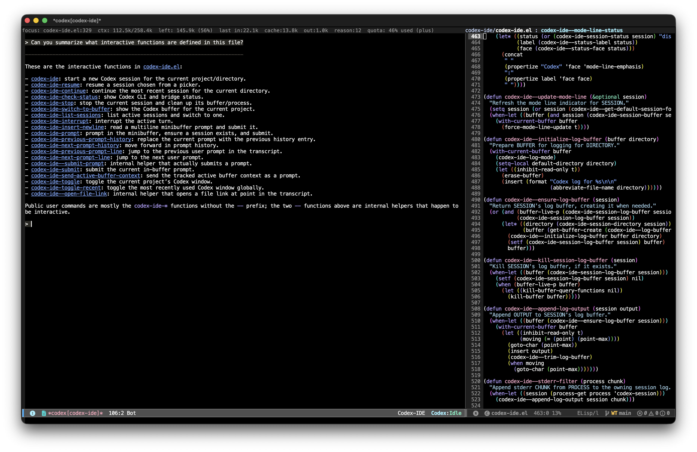
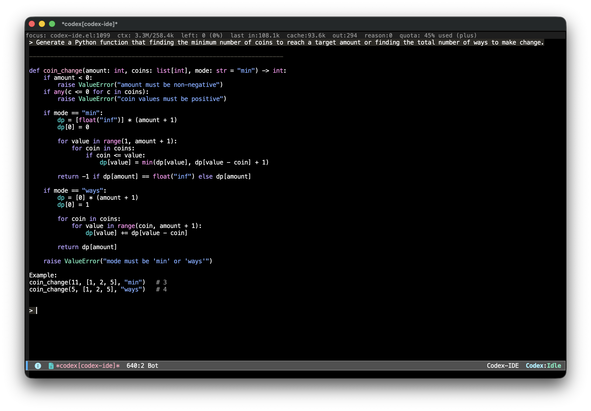
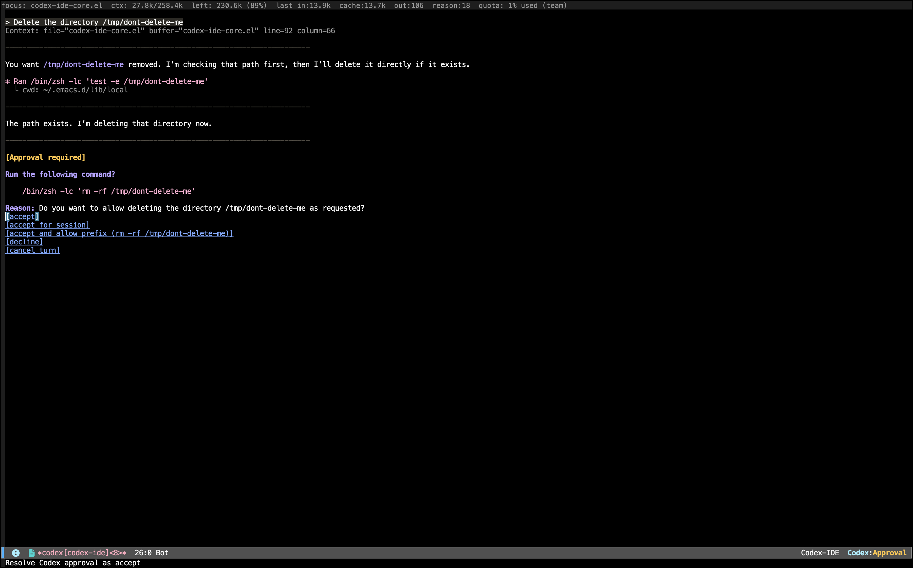

#+TITLE: Codex IDE for Emacs
#+AUTHOR: Duncan Gillis
#+DESCRIPTION: Codex app-server integration for Emacs
#+KEYWORDS: emacs, codex, openai, ai, tools
#+OPTIONS: toc:t num:nil

[[https://www.gnu.org/software/emacs/][file:https://img.shields.io/badge/GNU%20Emacs-28.1%2B-blue.svg]]
[[https://opensource.org/licenses/MIT][file:https://img.shields.io/badge/License-MIT-yellow.svg]]

* Overview

Codex IDE for Emacs is a pure Emacs Codex client, inspired by
[[https://github.com/manzaltu/claude-code-ide.el][claude-code-ide.el]].

This package provides native integration with =codex app-server= which unlike
terminal-based wrappers, renders Codex sessions as normal Emacs buffers and
keeps the interaction surface fully inside Emacs.

** Features

*** Codex Session Buffers

=codex-ide-session-mode= is the Emacs buffer interface for working with Codex:
write prompts in-place, read streamed responses, follow file links, and review
tool approvals without leaving the editor.

#+CAPTION: Clickable file links that jump from the transcript into source buffers.

#+CAPTION: Syntax-highlighted code rendered inside the Codex transcript.

#+CAPTION: Prompting Codex from an Emacs session buffer.

*** Codex Thread Lists

=codex-ide-session-thread-list= provides a tabulated Emacs mode for finding,
resuming, and deleting previous Codex sessions for the current workspace.

#+CAPTION: Stored workspace threads with previews, status, live buffers, and timestamps.
[[file:screenshots/codex-threads-list.png]]

#+CAPTION: Active Codex session buffers across workspaces.
[[file:screenshots/codex-buffer-list.png]]

*** Menus and Configuration

=codex-ide-menu= is the main entry point for starting, resuming, switching, and
inspecting Codex sessions. The configuration menu keeps model, approval,
sandbox, window, and bridge settings close at hand.

#+CAPTION: The main Codex IDE command menu.
[[file:screenshots/codex-ide-menu.png]]

#+CAPTION: The Codex IDE configuration menu.
[[file:screenshots/codex-ide-config-menu.png]]

* Installation

** Prerequisites

- Emacs 28.1 or higher
- Codex CLI installed and available on =PATH=
- =transient= installed
- =python3= and =emacsclient= available if you want the optional Emacs MCP bridge

** Installing Codex CLI

See the official app-server documentation:
[[https://developers.openai.com/codex/app-server#api-overview][OpenAI Codex app-server docs]].

** Installing the Emacs Package

To install using =use-package= with =:vc= on Emacs 30+:

#+begin_src emacs-lisp
(use-package codex-ide
  :vc (:url "https://github.com/dgillis/codex-ide" :rev :newest)
  :bind ("C-c C-;" . codex-ide-menu))
#+end_src

To install using =use-package= and [[https://github.com/radian-software/straight.el][straight.el]]:

#+begin_src emacs-lisp
(use-package codex-ide
  :straight (:type git :host github :repo "dgillis/codex-ide")
  :bind ("C-c C-;" . codex-ide-menu))
#+end_src

After installation, run =M-x codex-ide-menu= or =M-x codex-ide= to start a
session for the current project.

* Getting Started

** =codex-ide-menu=

Use =M-x codex-ide-menu= as the main entry point. It opens a transient menu for
starting a new session, continuing the most recent session, sending a prompt
from the minibuffer, switching to existing buffers, opening session lists, and
adjusting configuration.

#+CAPTION: The main menu is the recommended starting point for everyday Codex IDE commands.
[[file:screenshots/codex-ide-menu.png]]

** =codex-ide-session-mode=

=codex-ide-session-mode= is the buffer interface to Codex. It renders the
conversation transcript, keeps the active prompt editable in-place, streams
assistant output, turns file references into links, and handles interruption or
approval flows from inside Emacs.

Key bindings:

- =C-c RET= submits the active prompt.
- =C-c C-c= or =C-c C-k= interrupts the current response.
- =C-M-p= and =C-M-n= move between prompt lines.
- =M-p= and =M-n= cycle prompt history while point is in the active prompt.
- =TAB= and =S-TAB= move between clickable buttons and file links.

** =codex-ide-session-thread-list=

=codex-ide-session-thread-list= opens a tabulated list of active and previous
Codex sessions for the current workspace. Use it to inspect stored thread
previews, see which threads already have live buffers, resume previous work, or
delete old threads.

Key bindings:

- =RET= opens or resumes the thread at point.
- =D= deletes the thread at point, or every thread touched by the active region.
- =l= refreshes the list.
- Standard =tabulated-list-mode= keys sort and navigate the table.

* Examples

** Interactive Approvals

Commands that need confirmation use Emacs-native approval prompts, keeping
review and execution in the same session buffer.

#+CAPTION: Reviewing and approving a requested action directly from the Codex session.
[[file:screenshots/codex-approval-required-2x.gif]]

** Large Change Review

Codex can work through larger edits while the session buffer streams progress,
tool use, and follow-up prompts in one place.

#+CAPTION: Following a larger Codex change from the live session transcript.
[[file:screenshots/codex-ide-large-change-2x.gif]]

** Thread Navigation

Stored threads can be reopened from the workspace thread list, including older
sessions that are no longer live in an Emacs buffer.

#+CAPTION: Navigating the thread list and opening a previous Codex conversation.
[[file:screenshots/codex-threads-navigation-2x.gif]]

** Resume Stored Threads

Previous conversations can be restored into a new session buffer and continued
with their Codex thread context intact.

#+CAPTION: Resuming a stored thread and continuing the conversation in a session buffer.
[[file:screenshots/codex-resume-stored-thread-2x.gif]]

* License

This project is licensed under the [[https://opensource.org/licenses/MIT][MIT License]].

* Disclaimer

Codex® is a trademark of OpenAI. Codex® is an application developed by OpenAI.

This project is not affiliated with, endorsed by or sponsored by OpenAI.
